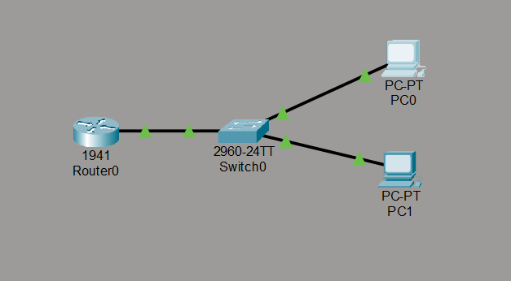
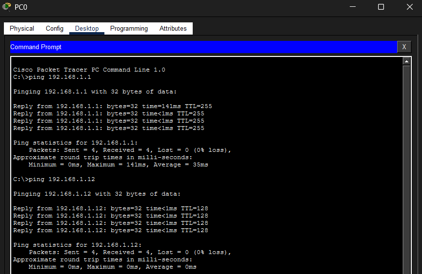

# Network Implementation - Level 1

## 1. Network Topology

---

## 2. IP Addressing Scheme

| Device   | Interface          | IP Address    | Subnet Mask     | Default Gateway |
|----------|--------------------|---------------|-----------------|-----------------|
| Router0  | GigabitEthernet0/0 | 192.168.1.1   | 255.255.255.0   | N/A             |
| PC0      | FastEthernet0      | 192.168.1.11  | 255.255.255.0   | 192.168.1.1     |
| PC1      | FastEthernet0      | 192.168.1.12  | 255.255.255.0   | 192.168.1.1     |

---

## 3. Ping Verification

