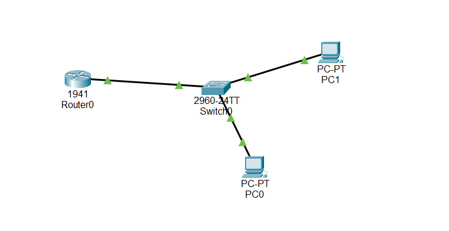

# Level 1 Submission Example

This file demonstrates a completed Level 1 task.

---

## 1. Network Topology
A simple network consisting of two PCs, one switch, and one router was created.

---

## 2. IP Addressing Scheme
The network is configured using the `192.168.1.0/24` range.

| Device | Interface           | IP Address     | Subnet Mask     | Default Gateway |
|--------|---------------------|----------------|-----------------|-----------------|
| Router | GigabitEthernet0/0  | 192.168.1.1    | 255.255.255.0   | N/A             |
| PC-A   | FastEthernet0       | 192.168.1.10   | 255.255.255.0   | 192.168.1.1     |
| PC-B   | FastEthernet0       | 192.168.1.11   | 255.255.255.0   | 192.168.1.1     |

---

## 3. Ping Verification
The following output shows a successful ping from **PC0** to **PC1**, confirming network connectivity.

Pinging 192.168.1.11 with 32 bytes of data:

Reply from 192.168.1.11: bytes=32 time<1ms TTL=128  
Reply from 192.168.1.11: bytes=32 time<1ms TTL=128  
Reply from 192.168.1.11: bytes=32 time<1ms TTL=128  
Reply from 192.168.1.11: bytes=32 time<1ms TTL=128  

Ping statistics for 192.168.1.11:
Packets: Sent = 4, Received = 4, Lost = 0 (0% loss),
Approximate round trip times in milli-seconds:
Minimum = 0ms, Maximum = 0ms, Average = 0ms
