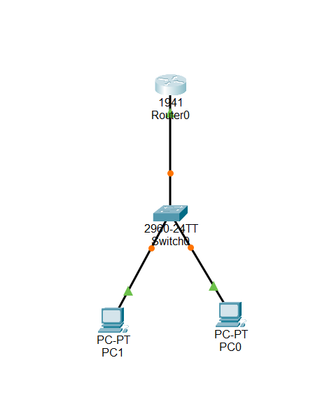
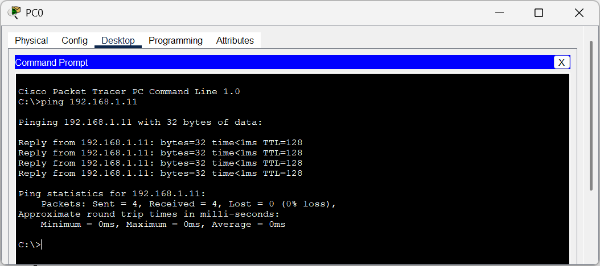

# Level 1 Submission by - Vijay Krishna

---

## 1. Network Topology
A simple network consisting of two PCs, one switch, and one router was created.

---

## 2. IP Addressing Scheme
The network is configured using the `192.168.1.0/24` range.

| Device | Interface           | IP Address     | Subnet Mask     | Default Gateway |
|--------|---------------------|----------------|-----------------|-----------------|
| Router | GigabitEthernet0/0  | 192.168.1.1    | 255.255.255.0   |    - N/A -      |
| PC-0   | FastEthernet0       | 192.168.1.10   | 255.255.255.0   | 192.168.1.1     |
| PC-1   | FastEthernet0       | 192.168.1.11   | 255.255.255.0   | 192.168.1.1     |

---

## 3. Ping Verification
The following output shows a successful ping from **PC-0** to **PC-1**, confirming network connectivity.

