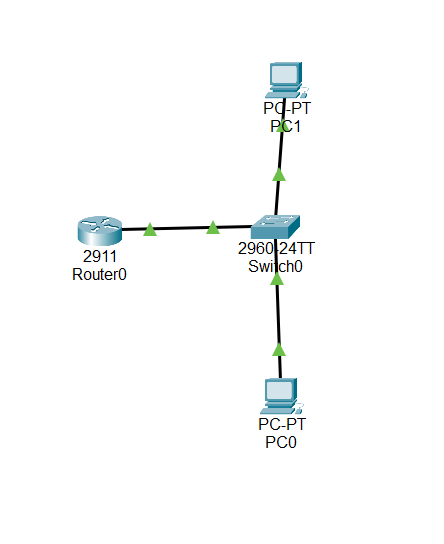
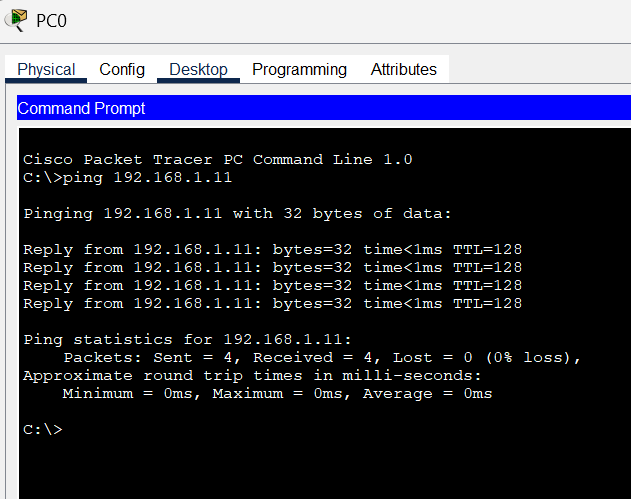

# Level 1: Network Foundations

## 1. Network Topology
A simple network consisting of two PCs, one switch, and one router was created.

---

## 2. IP Addressing Scheme
The network is configured using the `192.168.1.0/24` range.

| Device | Interface | IP Address | Subnet Mask | Gateway |
|---------|------------|-------------|--------------|----------|
| PC0 | FastEthernet0 | 192.168.1.10 | 255.255.255.0 | 192.168.1.1 |
| PC1 | FastEthernet0 | 192.168.1.11 | 255.255.255.0 | 192.168.1.1 |
| Router | GigabitEthernet0/0 | 192.168.1.1 | 255.255.255.0 | — |

---

## 3. Ping Verification
Ping tests were performed between PC-0 and PC-1 to confirm connectivity. Both PCs were able to successfully ping each other, verifying that the network configuration was correct.

---
