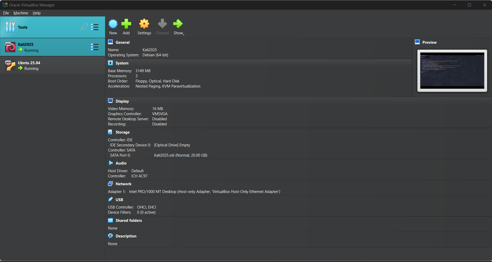
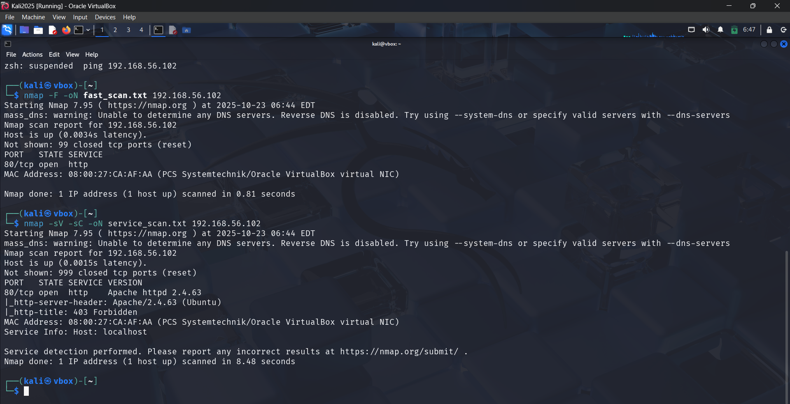

# Nmap Scan Report  
**Level 2 Submission — Network Scanning Lab**

**Author:** Janvi75  
**Date:** October 23, 2025  

**Purpose:**  
Perform network reconnaissance from a Kali Linux attacker machine against an Ubuntu target using Nmap to identify open ports, running services, and potential security risks in a controlled lab environment.

---

## 1. Lab Environment Setup

| Role | Operating System | IP Address | Virtualization | Network Mode |
|------|------------------|-------------|----------------|---------------|
| **Attacker VM** | Kali Linux | 192.168.56.101 | VirtualBox | Host-Only |
| **Target VM** | Ubuntu  | 192.168.56.102 | VirtualBox | Host-Only |

---

## 2. Nmap Commands Executed

nmap -F -oN fast_scan.txt <REDACTED_IP>
nmap -sV -sC -oN service_scan.txt <REDACTED_IP>

## 3. Scan Results Summary

Fast Scan Results (from fast_scan.txt)
# Nmap 7.95 scan initiated Thu Oct 23 06:44:28 2025
Host is up (0.0034s latency).
Not shown: 99 closed tcp ports (reset)
PORT   STATE SERVICE
80/tcp open  http

Observation:

- Only port 80 (HTTP) is open.
- All other 99 common TCP ports were closed.
- Indicates a minimal attack surface — only web service accessible.

Service & Version Scan Results (from service_scan.txt)

# Nmap 7.95 scan initiated Thu Oct 23 06:44:58 2025
Host is up (0.0015s latency).
Not shown: 999 closed tcp ports (reset)
PORT   STATE SERVICE VERSION
80/tcp open  http    Apache httpd 2.4.63
|_http-server-header: Apache/2.4.63 (Ubuntu)
|_http-title: 403 Forbidden

Detailed Findings:
| Port   | State | Service | Version                      | Notes                                                                                    |
| ------ | ----- | ------- | ---------------------------- | ---------------------------------------------------------------------------------------- |
| 80/tcp | open  | HTTP    | Apache httpd 2.4.63 (Ubuntu) | Web server accessible; returns 403 Forbidden; likely no index page or restricted access. |

Additional Info:

- Nmap script scan detected no additional vulnerabilities or exposures.
- Host identified as Ubuntu, running Apache web service.
- MAC address vendor suggests VirtualBox virtual NIC.

## 4. Key Findings

| # | Finding                    | Risk Level | Description                                                               |
| - | -------------------------- | ---------- | ------------------------------------------------------------------------- |
| 1 | Port 80 (HTTP) open        | Low        | Apache web service reachable; may serve restricted or local-only content. |
| 2 | Apache version 2.4.63      | Medium     | Check for known CVEs or outdated modules if unpatched.                    |
| 3 | Default 403 Forbidden page | Low        | Indicates web server is up but directory listing or index page disabled.  |

## 5. Security Recommendation

Recommendation: Harden and restrict the web service.

Actions:

1. Patch Apache: Ensure version 2.4.63 (Ubuntu) is the latest patched release — check for security updates (sudo apt update && sudo apt upgrade).

2. Limit exposure: If HTTP access is not required, disable or firewall port 80 (sudo ufw deny 80/tcp).

3. Configuration hardening:

- Disable directory listing.
- Remove or restrict access to unnecessary web directories.
- Ensure default or example files are removed.

4. Monitoring: Enable access logging and regularly review Apache logs for unauthorized access attempts.

## 6. Conclusion

The target system (192.168.56.102) is live with only one open port (HTTP - 80/tcp) running Apache/2.4.63.
No other services are exposed, reducing the attack surface.
Regular patching and web service configuration hardening are recommended to maintain security posture.

