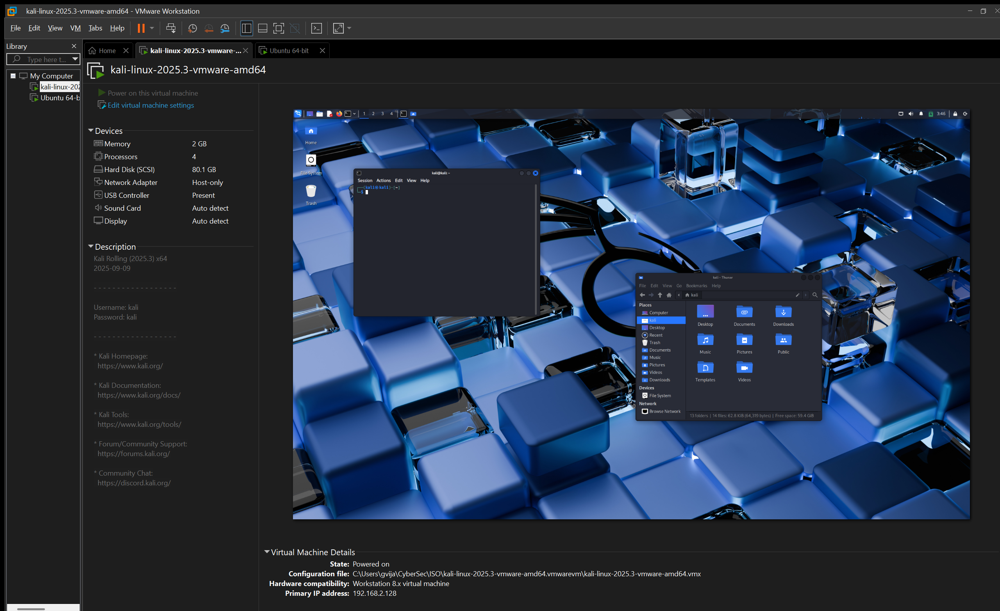

# Level 2 Submission: Nmap Scan Report
By :- Vijay Krishna

## 1. Lab Environment Setup
- **Attacker OS:** Kali Linux
- **Target OS:** Ubuntu
- **Virtualization Software:** VMware Workstation
- **Network Mode:** Host-Only

## 2. Nmap Commands Executed
```bash
nmap -F -oN fast_scan.txt 192.168.2.129
nmap -sV -sC -oN service_scan.txt 192.168.2.129
```

## 3. Screenshots
  
 


## 4. Top 3 Findings
- **Port/Service 1:**  21/tcp open vsftpd 3.0.5 (FTP)
- **Port/Service 2:**  22/tcp open OpenSSH 9.9p1 (SSH)
- **Port/Service 3:**  80/tcp open Apache/2.4.63 (HTTP)

## 5. Security Recommendation
- **Recommendation:** Use a firewall and/or a VPN service and turn off services when not in use.