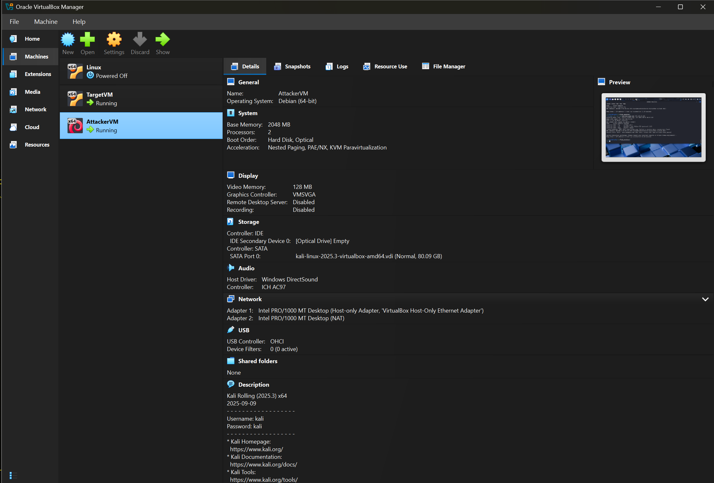
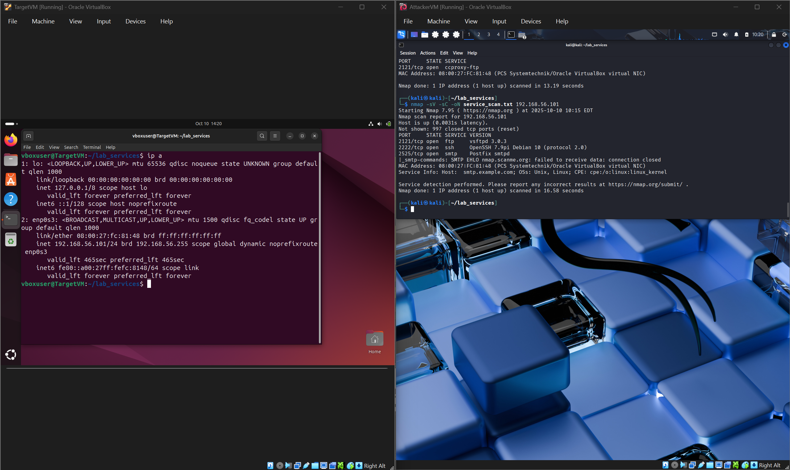
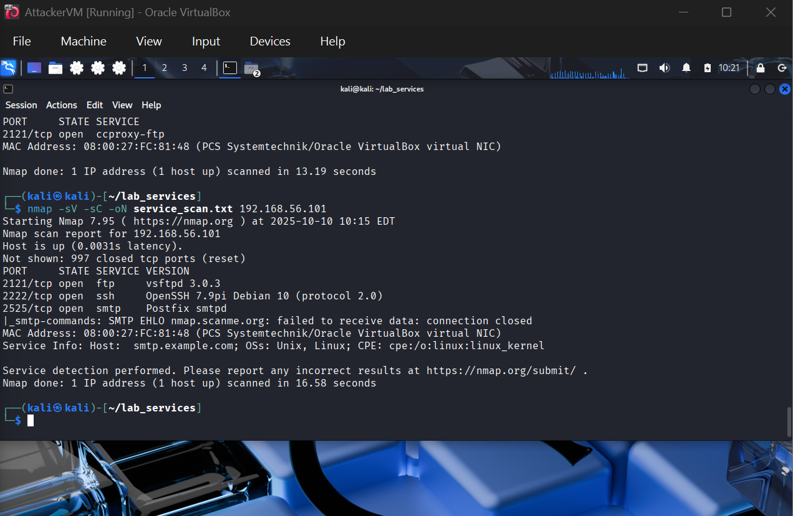

# Level 2 Submission: Nmap Scan Report

## 1. Lab Environment Setup
- **Attacker OS:** Kali Linux
- **Target OS:** Ubuntu
- **Virtualization Software:** Oracle VirtualBox
- **Network Mode:** Host-Only

## 2. Nmap Commands Executed
```bash
nmap -F -oN fast_scan.txt 192.168.56.101
nmap -sV -sC -oN service_scan.txt 192.168.56.101
```

## 3. Screenshots
  
 


## 4. Top 3 Findings
- **Port/Service 1:** 2121/tcp-vsftpd 3.0.3(FTP) 
- **Port/Service 2:** 2222/tcp-OpenSSH 7.9p1(SSH)  
- **Port/Service 3:** 2525/tcp-Postfix smtpd(SMTP)  

## 5. Security Recommendation
- **Recommendation:** Use a firewall and turn off services when we dont need them.